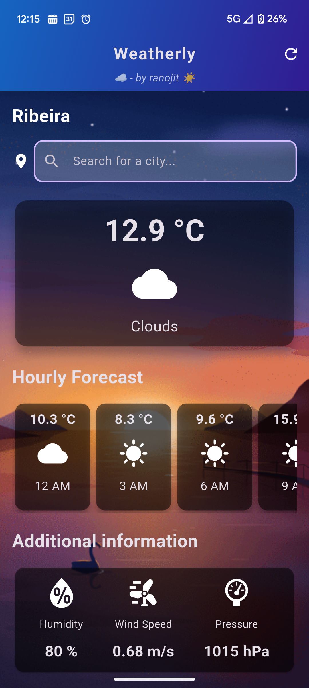
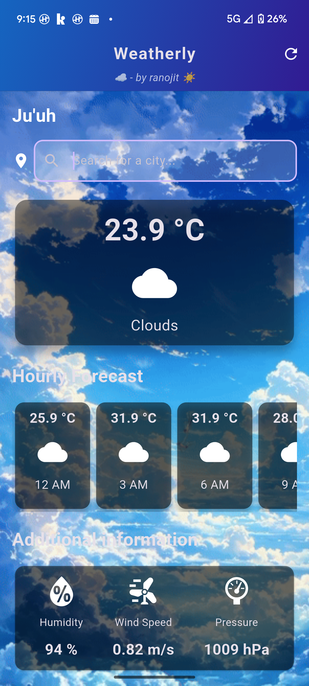
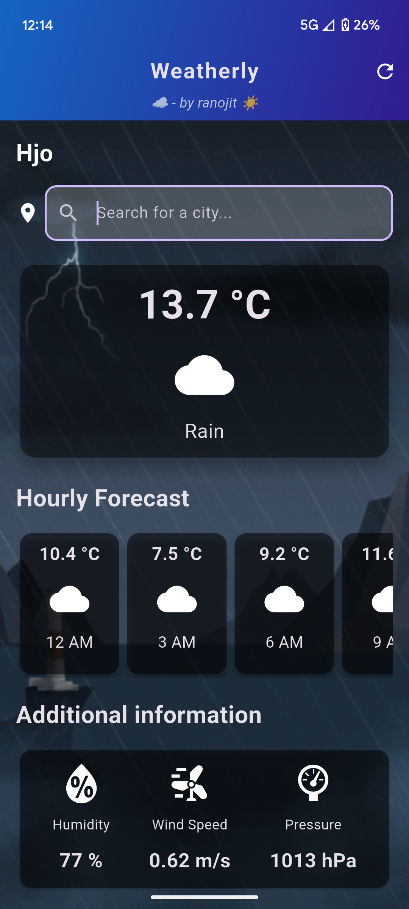
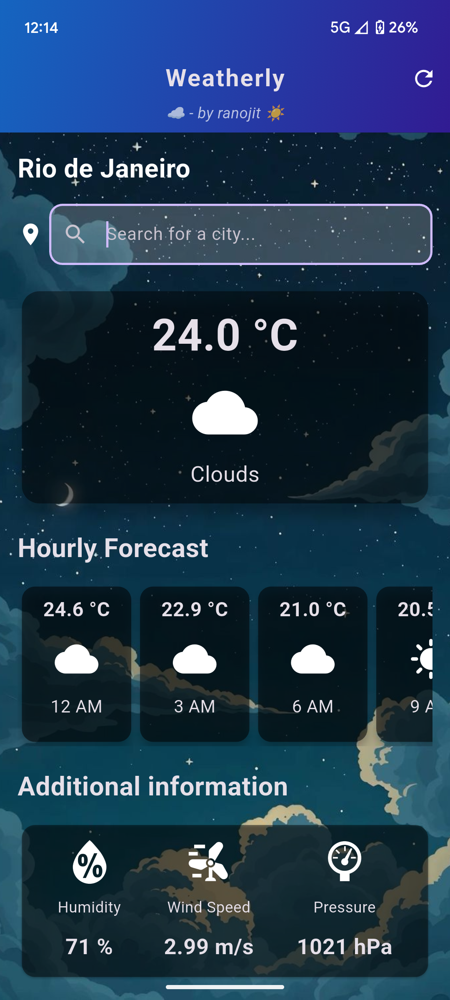
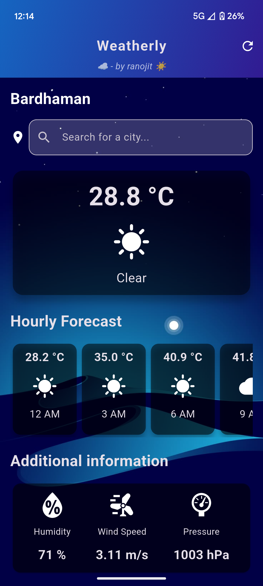

# Weatherly ☀️🌧️


A beautiful, modern Flutter weather app that brings you real-time weather updates, dynamic backgrounds, and a smooth user experience. 🌈

---

## 🚀 Features

- **Live Weather Data**: Real-time weather updates for any city worldwide using OpenWeatherMap API.
- **City Search**: Instantly search and select cities with autocomplete.
- **Dynamic Backgrounds**: Background changes based on weather and time of day for immersive experience.
- **Current Weather Card**: Displays temperature, weather type, and icon in a stylish card.
- **Hourly Forecast**: Scrollable cards for the next 5 hours.
- **Additional Info**: Humidity, wind speed, and pressure at a glance.
- **Modern UI**: Blurred app bar, gradients, and card-based layout.
- **Refresh Button**: Instantly update weather data.
- **Responsive Design**: Looks great on all devices.
- **Custom Icons**: Uses weather_icons and custom assets.

---

## 📱 Screenshots

> _Add your own screenshots in this section!_
## 📱 Screenshots

|Cloudy Evening  | City Search | Hourly Forecast | Extra 1 | Extra 2 |
|-------------|-------------|-----------------|---------|---------|
|  |  |  |  |  |

## 🛠️ Getting Started

1. **Clone the repository:**
   ```bash
   git clone https://github.com/yourusername/weatherly.git
   cd weatherly
   ```
2. **Install dependencies:**
   ```bash
   flutter pub get
   ```
3. **Add your OpenWeatherMap API key:**
   - Open `lib/api_key.dart` and insert your API key:
     ```dart
     const String apiKey = 'YOUR_API_KEY_HERE';
     ```
4. **Run the app:**
   ```bash
   flutter run
   ```

---

## 🧩 Dependencies
- [Flutter](https://flutter.dev/)
- [http](https://pub.dev/packages/http)
- [intl](https://pub.dev/packages/intl)
- [weather_icons](https://pub.dev/packages/weather_icons)
- [animated_splash_screen](https://pub.dev/packages/animated_splash_screen)
- [hugeicons](https://pub.dev/packages/hugeicons)
- [cupertino_icons](https://pub.dev/packages/cupertino_icons)
- [flutter_launcher_icons](https://pub.dev/packages/flutter_launcher_icons)

---

## ✨ Customization
- **App Icon:** 
- **Add your own screenshots** in `assets/images/` and update the paths above.

---

## 🙌 Credits
- Weather data powered by [OpenWeatherMap](https://openweathermap.org/)
- UI & Code by [ranojit](https://github.com/yourusername)

---

## 📄 License

This project is licensed under the MIT License. See the [LICENSE](LICENSE) file for details.
